# Course Project - Big Data Toolbox

## Run this project
Below are the steps needed to run this project on your Docker Engine. It is assumed that you want to run on a Google Kubernetes Engine Cluster

1. Pull Docker image
```
docker pull nafeej/bigdata-toolbox
```

2. Run Docker image
```
docker run -dit nafeej/bigdata-toolbox
```
This will produce a container ID. Copy it as shown below (yours will be different):\
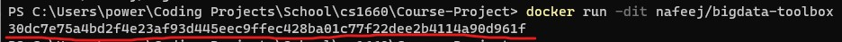

3. Enter container shell
```
docker exec -it (YOUR_CONTAINER_ID) bash
```

4. Create GCP project (skip if you have one already)
    * Go to [https://console.cloud.google.com/](https://console.cloud.google.com/)
    * Click "Select a project"\
    
    * Click "New project"\
    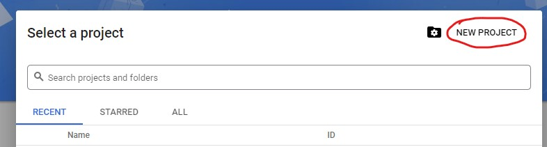
    * Set up project name and ID and click "Create"\
    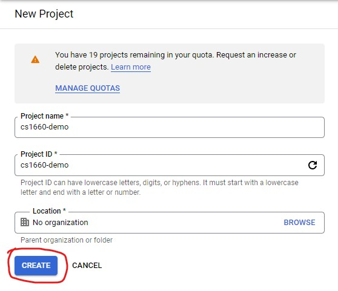

5. Authorize glcoud
```
gcloud auth login
```
Simply follow the instructions given by Google (make sure you choose the Google account you want the GKE cluster to run on)

6. Set Project ID
```
gcloud config set project (YOUR_PROJECT_ID)
```

7. Set up kubernetes cluster (skip if you have one already)
    * Search for Kubernetes Engine in GCP\
    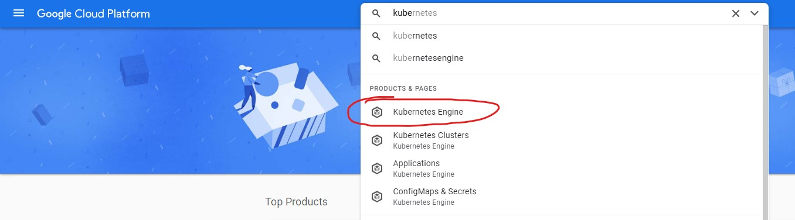
    * Enable Kubernetes API\
    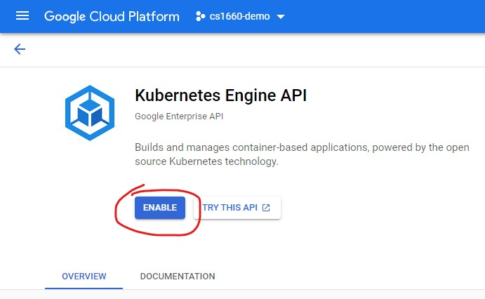
    * Create cluster\
    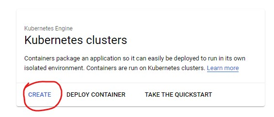
    * Choose autopilot mode\
    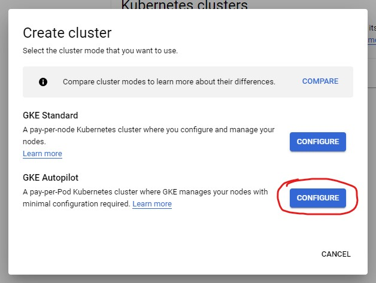
    * Name cluster and click create\
    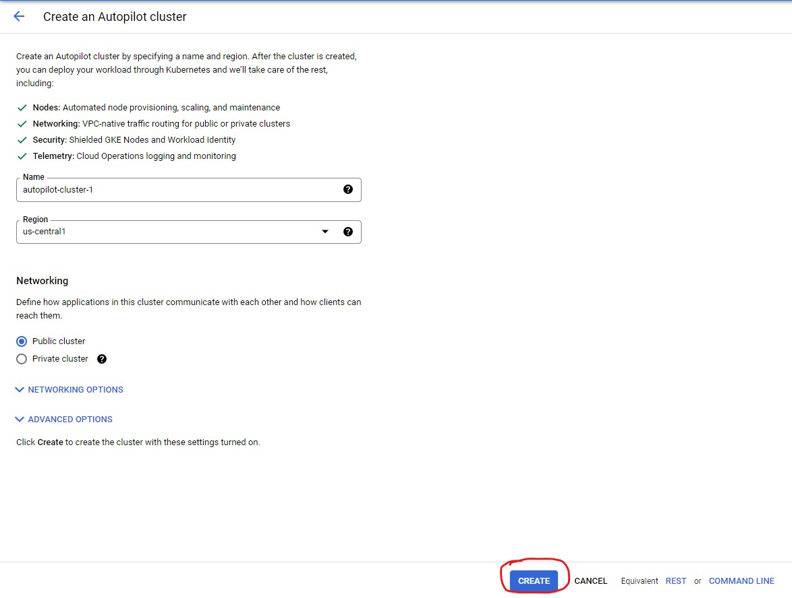

8. Connect cluster to container
    * Click on cluster\
    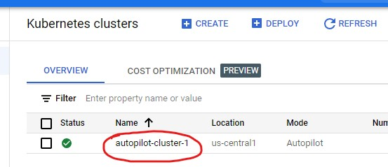
    * Click on connect\
    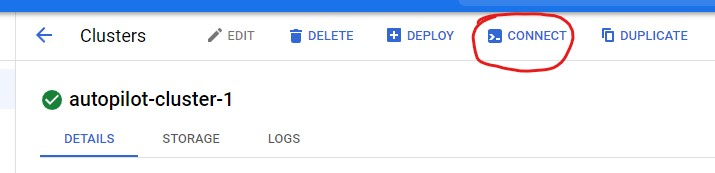
    * Copy command\
    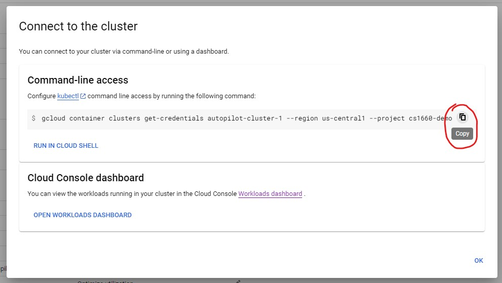
    * Paste command in shell\
    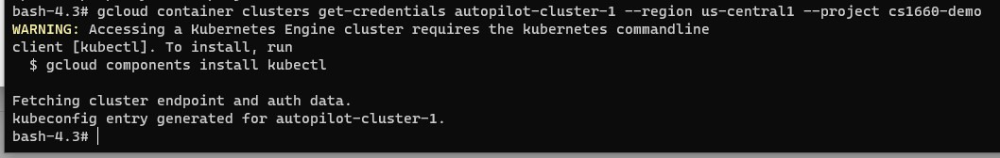

9. Run driver
```
python3 main.py
```