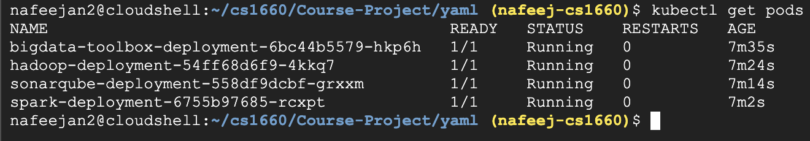

### Course Project - Big Data Toolbox

Microservice Docker image URLs:
* https://hub.docker.com/r/sequenceiq/hadoop-docker
* https://hub.docker.com/r/bitnami/spark
* https://hub.docker.com/_/sonarqube

Screenshot of containers running:

Steps used to run on Kubernetes:
1. Start minikube
2. Create deployment yaml files for Docker images which contain a line that pulls images from Docker Hub
3. Apply deployment files to Kubernetes cluster with kubectl